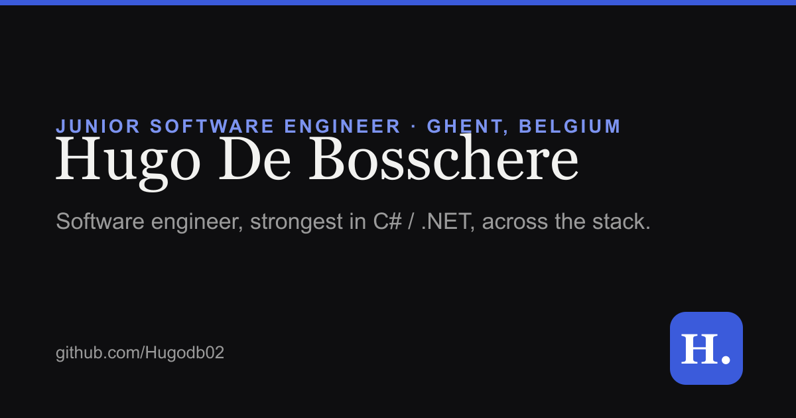

# Hugo De Bosschere · Portfolio

A clean, fast, single-page portfolio for **Hugo De Bosschere**, a junior software engineer from Ghent, Belgium. He builds software end to end, with his strongest ground in **C# / .NET** back-ends, and works across the stack with TypeScript, React Native and Remix.



> **Live:** [hugodebosschere.be](https://hugodebosschere.be)

---

## Tech stack

| Concern | Choice |
|---|---|
| Framework | [Astro](https://astro.build) (static output) |
| Styling | [Tailwind CSS v4](https://tailwindcss.com) (Vite plugin) |
| Language | TypeScript |
| Fonts | Self-hosted [Fraunces](https://fonts.google.com/specimen/Fraunces) + [Inter](https://fonts.google.com/specimen/Inter) via Fontsource |
| Hosting | Vercel |

Built with **zero client-side framework JavaScript**. The interactivity (theme toggle, sticky-nav highlight, mobile menu, custom cursor, reveal-on-scroll) is a handful of tiny inline scripts. The result is a near-instant, accessible page targeting Lighthouse ≥ 95 across the board.

## Features

- Single page: Hero · About · Selected Work · Experience · Education · Skills · Languages · Contact
- Light / dark mode with system-preference detection and no flash of the wrong theme
- Custom cursor (dot + trailing ring) on fine pointers, with reduced-motion and touch fallbacks
- Responsive from 375px to 1440px+, smooth scrolling, sticky nav with active-section highlight
- Optimised, responsive images via `astro:assets`
- Full SEO + Open Graph / Twitter card meta
- Content is fully visible without JavaScript

## Local development

```bash
# Node 18+ required
npm install
npm run dev      # start the dev server at http://localhost:4321
npm run build    # production build to ./dist
npm run preview  # preview the production build locally
```

## Project structure

```
src/
├── components/   # Astro UI components (Nav, Hero, About, SelectedWork, ...)
├── data/         # typed content: site, projects, experience, education, skills
├── layouts/      # BaseLayout (head, meta, theme bootstrap)
├── pages/        # index.astro (the single page)
└── styles/       # global.css (design tokens + Tailwind)
public/           # CV, favicons, social card, static assets
scripts/
├── generate-og.mjs          # regenerates the Open Graph image
└── generate-favicons.mjs    # regenerates the favicons from the source logo
```

## License

[MIT](./LICENSE) © 2026 Hugo De Bosschere
